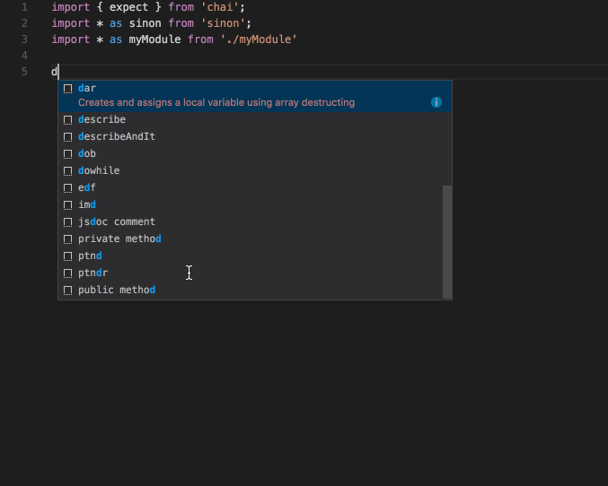

# ES6 Mocha Snippets for Visual Studio Code!
Mocha snippets for Visual Studio Code using ES6 syntax.  The focus is to keep the code dry leveraging arrow functions and omitting curlies by where possible.  The snippets use the Mocha function names for ease of memory that way you don't need to learn new names.



## Included Snippets
- Before (before)
    ```
    before(() => );
    ```
- Before Named Function (beforeNamed)
    ```
    before(function someFunctionName(){ });        
    ```
- Before With Description (beforeDescription)
    ```
    before('some description', () => );    
    ```
- Before Each (beforeEach)
    ```
    beforeEach(() => );
    ```
- Before Each Named Function (beforeEachNamed)
    ```
    beforeEach(function someFunctionName(){ });
    ```
- Before Each With Description (beforeEachDescription)
    ```
    beforeEach('some description', () => );
    ```
- After (after)
    ```
    after(() => );
    ```
- After Named Function (afterNamed)
    ```
    after(function someFunctionName(){ });
    ```
- After With Description (afterDescription)
    ```
    after('some description', () => );
    ```
- After Each (afterEach)
    ```
    afterEach(() => );
    ```
- After Each Named Function (afterEachNamed)
    ```
    afterEach(function someFunctionName(){ });
    ```
- After Each With Description (afterEachDescription)
    ```
    afterEach('some description', () => );
    ```
- Describe And It (describeAndIt)
    ```
    describe('some thing', () => {
        it('can do the thing', () => {
        
        });
    });
    ```
- Describe (describe)
    ```
    describe('some thing', () => {
    
    });
    ```
- It (it)
    ```
    it('can do the thing', () => {
    
    });
    ```

### Other Great Tools:
* [Visual Studio Code](http://code.visualstudio.com/)
* [Mocha](https://mochajs.org/)
* [Sinon JS](http://sinonjs.org/)
* [Chai JS](https://chaijs.com/)

### Supported languages (file extensions)
* JavaScript (.js)
* TypeScript (.ts)
* JavaScript React (.jsx)
* TypeScript React (.tsx)

